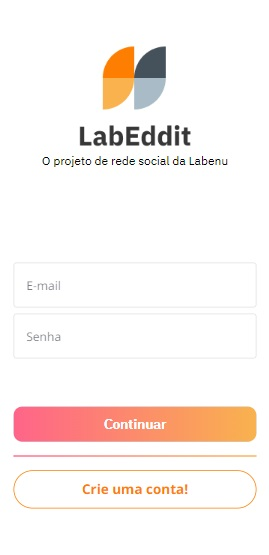
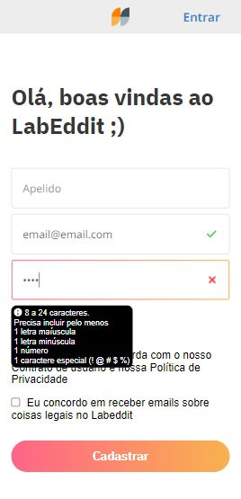
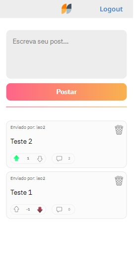
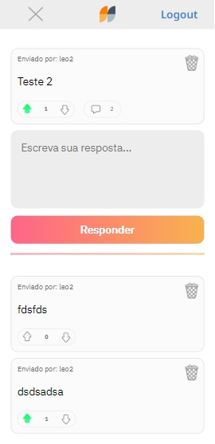
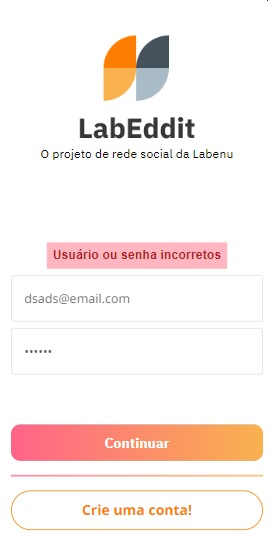
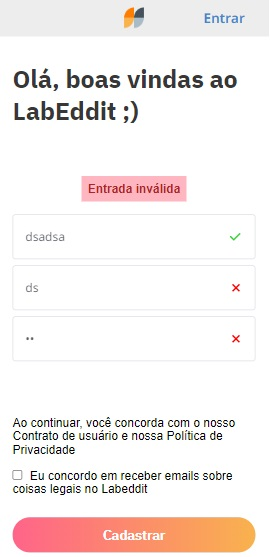

# Labeddit - frontend

Projeto de fórum online que permite a criação de postagens e discussões através de comentários, inspirado no Reddit, com funcionalidade de Upvote e Downvote nos posts e comentários.

&nbsp;
## Sobre o projeto

Este projeto é corresponde ao front-end da aplicação Labeddit, desenvolvido em React.js e Typescript. Foi idealizado como projeto de conclusão do bootcamp web fullstack Labenu e, juntamente com o back-end ([disponível aqui](https://github.com/lcarrati/labeddit-backend)), representa uma aplicação completa desenvolvida do zero até o deploy. 

&nbsp;
## Live Preview

Confira o projeto em funcionamento [neste link](https://labeddit-frontend-lcarrati.vercel.app/).

&nbsp;
## Ferramentas Utilizadas

Neste projeto, utilizei as seguintes ferramentas e tecnologias:

- React.js
- Typescript
- React Router
- Styled-components
- AXIOS
- HTML5
- CSS3

&nbsp;

## Features
* Feedback de erros - Ao efetuar cadastro ou login, caso receba um erro uma mensagem será exibida na página indicando o motivo da falha (senha incorreta, usuário já existe, erro no servidor, etc.)

* Validação de input - Ao realizar o cadastro é exibida uma validação visual de email e senha.

* SPA com navegação completa e funcional

* Validação de Upvote & Downvote - Cada usuário só tem permissão para 1 upvote ou 1 downvote em cada post ou comentário, sendo livre para remover ou alternar entre eles.

* Validação de usuários - Cada usuário pode apagar seu próprio post ou comentário, administradores podem apagar qualquer post ou comentário.

* Persistência - Este aplicativo utiliza cookies para persistir o login, ao realizar o logout o cookie é apagado.

&nbsp;
## Conclusão

Este projeto é uma demonstração do desenvolvimento das minhas habilidades e conhecimentos em React.js e Typescript. Estou empolgado em aplicar o que aprendi ao longo do deste projeto para buscar oportunidades na área de programação.

Sinta-se à vontade para explorar o projeto e, se tiver alguma dúvida ou sugestão, considere-se convidado à em entrar em contato comigo!

&nbsp;
## Imagens
### Componente de login

### Componente de cadastro

### Criação e listagem de posts

### Criação e listagem de comentários do post

### Feedback de erro de login

### Feedback de erro de cadastro
